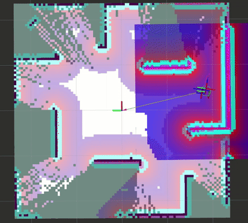

## REFLEX Explorer — Reactive Frontier Exploration with Local Exemptions

**REFLEX Explorer** is a lightweight **ROS 2** node that drives autonomous map exploration on **Nav2** by selecting frontier-adjacent goals using a **reactive, nearest-first** policy with **local exemptions** to avoid loops and thrashing. It’s designed to be practical, debuggable, and drop-in for small to medium size indoor robots (e.g., **TurtleBot3**).

- **ROS 2:** Humble (tested)  
- **Packages:** `nav2_reflex_explore` (this repo), Nav2 stack running separately  
- **Action client:** `/navigate_to_pose`  
- **Subs:** `/map` (`nav_msgs/OccupancyGrid`), `/cmd_vel` (for progress heuristics)



---

## Why another explorer?

Most “classical” frontier explorers pick frontiers, cluster them, and plan to centroids. In practice this can cause:

- goals re-issued under the robot,  
- oscillation between nearby frontiers,  
- long detours to distant, high-gain clusters,  
- premature “done” when unknown space remains but the candidate selector stalls.

**REFLEX keeps things simple and robust:**

- **Nearest-first** with **BFS feasibility** (unknown treated as traversable for feasibility only).  
- **Local exemptions:** recently visited spots are temporarily suppressed (radius+time) so we don’t re-pick the same goal after arrival/cancel.  
- **Underfoot guard:** if the chosen goal is already under the robot (`near_goal_epsilon_m`), it’s **skipped and suppressed**, never re-sent.  
- **Plateau-of-progress stop:** exploration ends only when unknown ratio improves too slowly over a window (and only after at least one success).  
- **Small-step bootstrap:** allows very short, reachable moves early so the robot starts exploring without manual teleop.

---

## Architecture at a glance

1. **Frontier extraction:** thin core that returns frontier points; REFLEX scores and filters them.  
2. **Goal selection loop:**
   - refresh backlog from latest map,
   - filter by info gain and visited suppression,
   - pick **nearest eligible** by Euclidean distance (ties → score),
   - verify **short BFS** reachability (occupied blocked, unknown allowed),
   - **send `NavigateToPose` once**; never re-send same goal underfoot.

---

## Differences vs. “classical” frontier exploration

| Aspect | Classical | REFLEX |
|---|---|---|
| Frontier choice | Clustered, often global scoring | **Nearest-first (reactive)** |
| Loop avoidance | Heuristics, sometimes absent | **Visited-suppression + underfoot guard** |
| Feasibility test | Sometimes none or costmap probe | **BFS in grid (unknown ok, occupied blocked)** |
| Finish condition | Unknown threshold or queue empty | **Plateau-of-progress + unknown threshold fallback** |
| After goal reach | May re-pick same spot | **Suppresses just-visited area for a cooldown** |

**Trade-offs:** REFLEX is intentionally simple; it won’t “globally optimize” exploration routes. In highly structured environments with large loops, global sequencing may reduce path length more than REFLEX. The flip side is that REFLEX is **stable, reactive**, and tends to avoid local oscillations with minimal tuning.

---

## Install & Build (ROS 2 Humble)

```bash
# Workspace
mkdir -p ~/ros2_ws/src && cd ~/ros2_ws/src

# Add this repo into src (clone your fork)
git clone <your_fork_url> nav2_reflex_explore
cd ..

# Build
source /opt/ros/humble/setup.bash
colcon build --symlink-install

# Overlay
source install/setup.bash
```

---

## Quickstart (TurtleBot3 Gazebo + Nav2)

Bring up TB3 Gazebo **Stage 4** world and Nav2 (SLAM on, sim time true). Use separate terminals:

```bash
# Terminal A: Gazebo
source /opt/ros/humble/setup.bash
ros2 launch turtlebot3_gazebo turtlebot3_dqn_stage4.launch.py
```

```bash
# Terminal B: Nav2 + SLAM
source /opt/ros/humble/setup.bash
ros2 launch turtlebot3_navigation2 navigation2.launch.py use_sim_time:=true slam:=True
```

```bash
# Terminal C: REFLEX
source ~/ros2_ws/install/setup.bash
ros2 launch nav2_reflex_explore explore.launch.py   params_file:=<your_ws>/src/nav2_reflex_explore/params/explorer_params.yaml   map_save_path:=/absolute/path/prefix   # optional
```

> If the first goal is under the robot you’ll see: **“Goal is already under robot ... Skipping send.”**  
> Nudge once with teleop or wait—REFLEX will pick the next eligible frontier.

---

## Launcher
**Usage**
```bash
ros2 launch nav2_reflex_explore reflex_explore.launch.py   params_file:=/absolute/or/workspace/path/to/explorer_params.yaml   map_save_path:=/absolute/path/prefix   # optional
```

**Arguments**
- **`params_file` (required):** Path to your REFLEX YAML (node key: `reflex_explorer`).  
- **`map_save_path` (optional, absolute):** Prefix for saved maps.  
  - If omitted/empty, maps are written under the repo:  
    `<your_ws>/src/nav2_reflex_explore/maps/<YYYYMMDD-HHMMSS>/map.{yaml,pgm}`

---

## Parameters

| Name | Type | Default | Notes |
|---|---|---|---|
| `global_frame` | string | `map` | Planning/global frame |
| `robot_base_frame` | string | `base_link` | Robot base frame for TF lookup |
| `use_sim_time` | bool | `true` | Typical in sim |
| `sensor_range` | double | `3.5` | Info-gain radius (meters) |
| `min_frontier_cells` | int | `12` | Minimum cells to accept a frontier |
| `min_info_gain_cells` | int | `10` | Minimum unknown cells near a candidate |
| `edge_ignore_margin_m` | double | `0.25` | Ignore band near map edges |
| `dedupe_radius_m` | double | `0.5` | Merge near-duplicate candidates |
| `refresh_period_sec` | double | `2.0` | Backlog refresh cadence |
| `retry_cooldown_sec` | double | `5.0` | Wait before retrying a failed goal |
| `max_attempts_per_goal` | int | `3` | Cap attempts before discarding a goal |
| `cancel_cooldown_sec` | double | `1.5` | Delay after cancel before re-planning |
| `min_goal_runtime_sec` | double | `6.0` | Don’t cancel too quickly |
| `progress_timeout_sec` | double | `10.0` | Cancel if no progress for this long |
| `progress_dist_thresh_m` | double | `0.05` | Movement needed to count as “progress” |
| `min_unknown_ratio` | double | `0.02` | Fallback completion criterion |
| `near_goal_epsilon_m` | double | `0.35` | Under-robot guard: skip & suppress |
| `visited_suppress_radius_m` | double | `0.8` | Local exemption radius (meters) |
| `visited_suppress_sec` | double | `30.0` | Local exemption time (seconds) |
| `plateau_enable_unknown_ratio` | double | `0.25` | Only consider plateau when mostly explored |
| `plateau_sample_sec` | double | `4.0` | Sampling cadence for plateau check |
| `plateau_window_sec` | double | `60.0` | Rolling window duration |
| `plateau_min_improve` | double | `0.01` | Relative improvement threshold to continue |
| `plateau_warmup_sec` | double | `20.0` | Ignore plateau early in a goal |
| `plateau_transit_dist_m` | double | `2.0` | Ignore plateau while far from goal |
| `plateau_autoscale_window` | bool | `true` | Tie window to ETA by distance remaining |
| `plateau_min_window_sec` | double | `45.0` | Lower bound on window duration |
| `plateau_max_window_sec` | double | `240.0` | Upper bound on window duration |
| `plan_speed_guess_mps` | double | `0.22` | Used to estimate ETA for autoscaling |
| `save_when_done` | bool | `true` | Save map when exploration finishes |

A tuned example YAML is located at **`params/explorer_params.yaml`**.

---

## Map saving

- **Default (no `map_save_path`):**  
  `<your_ws>/src/nav2_reflex_explore/maps/<YYYYMMDD-HHMMSS>/map.yaml|pgm`

- **Override on CLI:**
  ```bash
  ros2 launch nav2_reflex_explore explore.launch.py     params_file:=...     map_save_path:=/home/user/map1
  ```

---

## Example runs

- **TurtleBot3 DQN Stage 4:**  
[](https://www.youtube.com/watch?v=Rj_86SqVt9Q "Click to watch")

- **TurtleBot3 DQN Stage 3:**  
[](https://www.youtube.com/watch?v=SIms-SYgOpg "Click to watch")

- **TurtleBot3 DQN Stage 1:**  
[](https://www.youtube.com/watch?v=h6Z1QZj65Ko "Click to watch")

---

## Troubleshooting

- **“Backlog=0 (unknown~0.79) and no motion”**  
  Lower `min_frontier_cells` / `min_info_gain_cells`, increase `sensor_range`, or reduce `edge_ignore_margin_m`. Ensure `/map` is publishing and frames are correct.

- **Keeps sending the same goal**  
  You should see “Goal is already under robot ... Skipping” in logs; if not, reduce `near_goal_epsilon_m` or increase `visited_suppress_radius_m` / `visited_suppress_sec`.

- **Immediate finish at start**  
  Increase `plateau_enable_unknown_ratio` (e.g., `0.5`) so plateau isn’t checked too early; raise `plateau_window_sec` / `plateau_min_improve`.

---

## Limitations

- Not globally optimal; prioritizes **stability and reactivity** over tour-length minimization.  
- BFS feasibility treats **unknown as traversable** to avoid over-pruning early; Nav2 may still reject difficult goals (REFLEX retries or suppresses).  
- Heavily cluttered environments may require tuning `min_frontier_cells` and suppression radii.

---

## Use cases

1. **Apartment/office sweep:** Quick mapping of tight rooms and doorways; nearest-first keeps progress steady while local exemptions prevent re-picks at thresholds.

2. **Warehouse aisle scouting:** Reactively clears unknown pockets along aisles on SBC-class bases; BFS feasibility favors short, practical moves without heavy compute.

3. **Manufacturing changeover remap:** After line reconfiguration, quickly rebuild maps around new fixtures and workcells; nearest-first + BFS feasibility clears local unknowns without heavy compute.

---

## Contributing

Issues and PRs are welcome. Please include:
- Environment (ROS distro, sim/real)  
- Your params file  
- Logs that show REFLEX messages  
- Optional bag snippets

---

## License

**Apache-2.0** (see `LICENSE`).

---

## Citation

If you use REFLEX in academic work, please cite the repository and refer to this approach as:

> **REFLEX — Reactive Frontier Exploration with Local Exemptions**